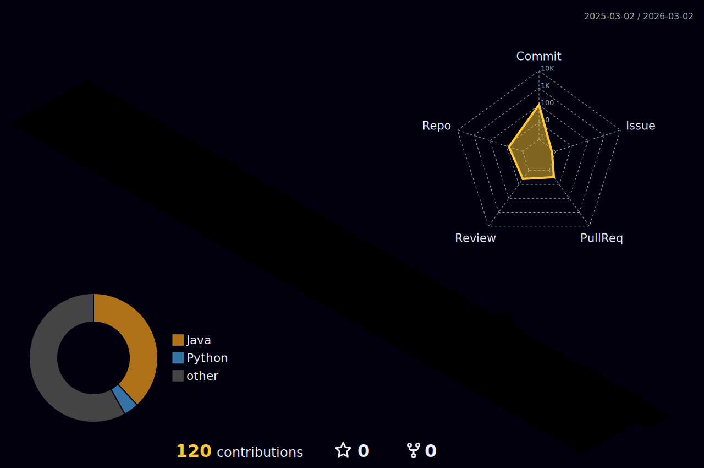

## Hi! I'm Jin 👋
Java & Spring 기반 백엔드 개발자를 목표로 학습하고 있습니다.  
이 README는 제가 어떤 개발자로 성장해가는지 기록하기 위한 공간입니다.

## Projects

## Career

## Activity

## Tech Stacks
Core Backend:   

Build & Test:  

DevOps: 

Tools:     

📚 Also experienced with:      

